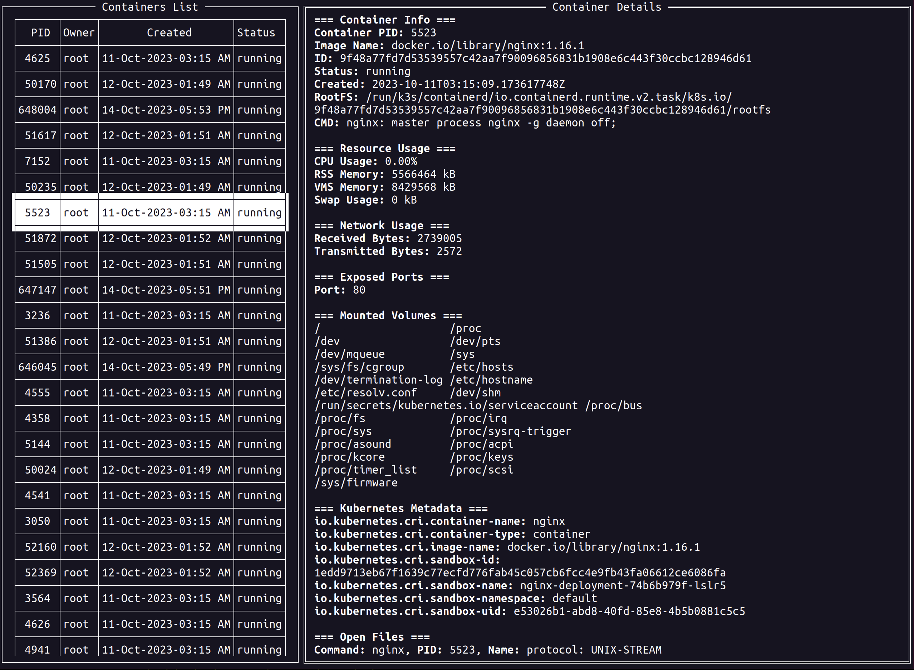

  

Tachyon is a user-friendly Terminal User Interface application that offers detailed insights into containers running on your system.

Tachyon is designed to function with the [containerd](https://containerd.io/) runtime. Support for other runtimes may come later.

## Features:

- **Containers Overview**: View a comprehensive list of all running containers with essential details.
- **Detailed Container View**: Dive deeper into specific container details by selecting them.
- **Convenient Keyboard Shortcuts**:
  - `Right Arrow`: Navigate to the container details view.
  - `Left Arrow`: Return to the containers table view.
  - `Up/Down Arrows`: Scroll through the list or navigate container details.
  - `r`: Force refresh to get updated container data.
  - `q`: Quit the application.
- **Efficient Cache System**: Tachyon caches container information for faster access and minimizes redundant fetch operations.
- **Automatic Data Refresh**: Ensures your data stays up-to-date by periodically refreshing container information.

## Getting Started:

To get started with Tachyon, follow these steps:

- Download Tachyon from the releases section or clone the repository and compile it yourself.
- Verify that you have the necessary dependencies, as mentioned in the Dependencies section.
- Run Tachyon with sudo privileges.

## Dependencies:

Tachyon utilizes [gopsutil](https://github.com/shirou/gopsutil) to gather essential information about running containerized processes. However, for deeper insights, Tachyon also leverages additional Linux tooling.

Tachyon relies on the following additional dependencies: [runc](https://github.com/opencontainers/runc), [lsof](https://github.com/lsof-org/lsof), [netstat](https://linux.die.net/man/8/netstat), [nsenter](https://man7.org/linux/man-pages/man1/nsenter.1.html), [ifconfig](https://www.man7.org/linux/man-pages/man8/ifconfig.8.html)

## License:

This project is licensed under the [MIT License](LICENSE).

## Contributing:

Contributions are welcome! If you have something to add or improve, please submit a pull request. For bug reports you can submit an issue. 